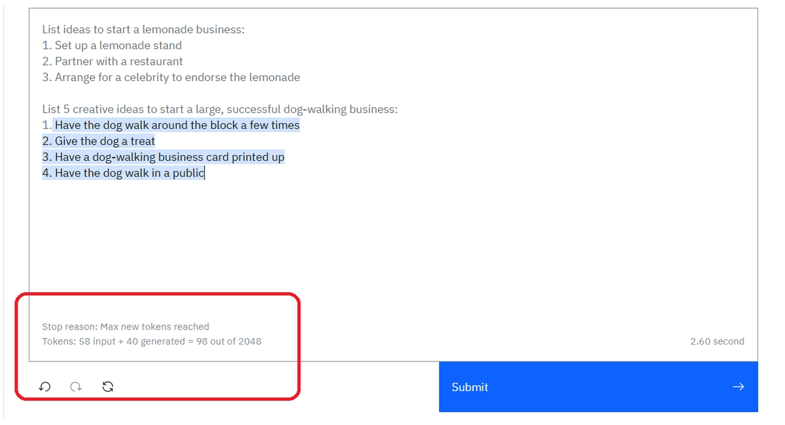
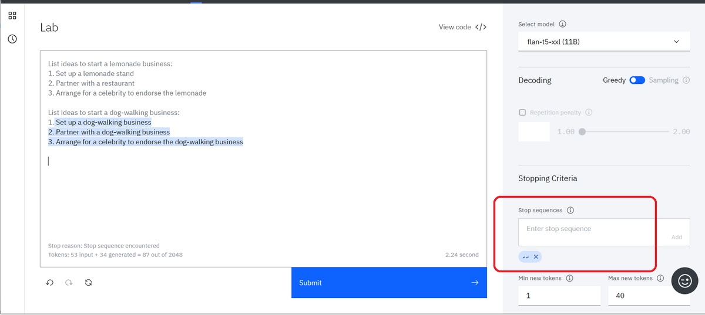
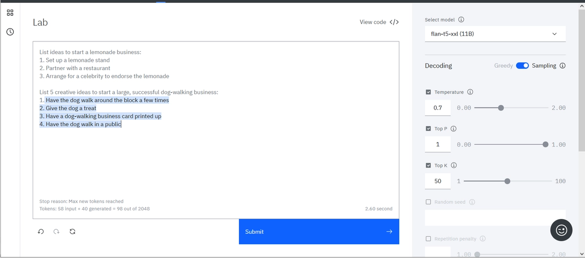

# Prompt engineering

**Note:** The images below show actual results from watsonx.ai. The slightly gray text is the prompt. The text highlighted in blue is the response of the model.

### 1.0 LLMs Foundations
Before we can explore the possibilities of watsonx.ai, we first need to understand how large language models (LLMs) work and how we can fine-tune the model and its parameters to influence the final result.


After opening watsonx.ai, you should see the above view. The large central text area is the Prompt Lab, which is nothing more than our workspace. On the right side there are sections that allow you to change the parameters of the selected model. Changing the parameters affects the content generated by the model. In turn, in the lower left corner, after performing the query to Prompt Lab, there is a summary of the number of tokens used to generate the model response.

### 1.1 Tokens

Each time you enter a prompt, the number of your "input tokens" and "output tokens" will be updated. Tokens are an important concept to understand because tokens limit the performance of the model and also determine the cost of each query. One of the important conclusions you will be able to draw from the laboratory is that tokens do not correspond to words in a natural language in a 1: 1 ratio. One token corresponds to an average of 4 characters, and the characters include not only letters, but also commas, dots and spaces. Before each prompt is sent to the model, the prompt is tokenized or divided into smaller subsets of characters, because the text in this form is much more understandable for a large language model.

The models, depending on their specificity, allow the processing of a maximum of 2048 or 4096 tokens. Because the number of input tokens and output tokens add up, the more accurate the prompt, the smaller the model response resources.

### 1.2 It is all in the prompt

One of the most important things we want to convey during the lab is that watsonx.ai is not a chatbot interface. Therefore, simply stating an instruction or question rarely produces a good result. For example, what if we ask watsonx.ai to:

```
List ideas to start a dog-walking business?
```


<p> </p>

### 1.3 Cue the output structure

We can see from the above example that simple prompts do not work with smaller LLMs. To receive a structured response, include a cue to start the response in the desired structure. For example, just adding these two characters, "1.", dramatically improves the response.


<p> </p>

### 1.4 Provide an example as guidance (or Single Shot Prompting)

To receive a higher-quality response, provide an example of the kind of response you want. In technical terms, this is called Single Shot Prompting.


As you can see, providing one example before generating with your LLM is called Single Shot Prompting, but adding more examples into your prompt is common practice as well. Generally, increasing the number of examples is referred to as “Few Shot Prompting” and is a powerful tool to ensure you have a specific output.

Copy paste to get started experimenting:

```
List ideas to start a lemonade business:
1. Setup a lemonade stand
2. Partner with a restaurant
3. Arrange for a celebrity to endorse the lemonade

List ideas to start a dog-walking business:
1. 
```

### 1.5 Include descriptive details

The more guidance, the better:

- Content
- Style
- Length


# Model Parameters

### 2.0 Adjusting the model's behaviour
The first change we can make is what model (LLM) we use to evaluate our prompt. This is one of the biggest changes you can make, as certain models are better built for specific tasks. The exercises later on this lab will force you to change the model you use if you want to answer some of the more challenging questions.

In general, some models perform better working with summarization, key words, and semantics, while other models do better with structured text such as HTML, markdown, or JSON. The best way to figure out which models apply for your use case is to simply test them, but it is important to know that choice of model can make a big difference!

watsonx.ai also provides multiple parameters for configuring how LLMs respond to a prompt. Selecting the correct parameters can often be more art than science. Investing time into understanding then tweaking these parameters will be rewarded by better responses.

Explore these parameters with the following text:

```
List ideas to start a lemonade business:
1. Setup a lemonade stand
2. Partner with a restaurant
3. Arrange for a celebrity to endorse the lemonade

List ideas to start a dog-walking business:
1. 
```

### 2.1 Set the min and max tokens

If you're finding the generated text is too short or too long, try adjusting the parameters that control the number of new tokens:

- The **Min new tokens parameter** controls the minimum number of tokens (~words) in the generated response
- The **Max new tokens parameter** controls the maximum number of tokens (~words) in the generated response




### 2.2 Specify stop sequences

If you specify stop sequences, the output will automatically stop when one of the stop sequences appears in the generated output.

**Example**

The output in the following image goes too far, there are two answers:


In the following image, the stop sequence of two carriage returns is specified:


The following image shows the effect of the stop sequence. The output stops after two carriage returns:



### 2.3 Adjust decoding parameters

If the response is too generic or going on wild tangents, consider adjusting the decoding parameters. Or conversely, the response may not be creative enough.

**Decoding** is the process of finding the output sequence given the input sequence:

- **Greedy decoding** selects the word with the highest probability at each step of the decoding process.
- **Sampling decoding** selects words from a probability distribution at each step:
  - **Temperature** refers to selecting high- or low-probability words. Higher temperature values lead to more variability.
  - **Top-p** (nucleus sampling) refers to selecting the smallest set of words whose cumulative probability exceeds p.
  - **Top-k** refers to selecting k words with the highest probabilities at each step. Higher values lead to more variability.

An advantage of greedy decoding is that you will see reproducible results. This can be useful for testing. Setting temperature to 0 in a sampling decoding approach gives the same variance as greedy decoding.





### 2.4 Add a repetition penalty

Sometimes, you'll see text being repeated over and over:


Increasing the temperature can sometimes resolve the problem.

However, when text is still repetative even with a higher temperature, you can try adding a repetition penality. The higher the penalty, the less likely the results will include repeated text.


# General advice

### 3.1 Check your use case

LLMs have great potential, but they have no logic, no knowledge, and no domain expertise. Some use cases are a better fit than others: LLMs excel at tasks that involve generating generic text or common code patterns and transforming given input.

If your prompt includes all the tips and best practices discussed here, yet you're not getting good results from any of the models, consider whether your use case might be one that LLMs just cannot handle well.

### 3.2 Find out more

Check [NLP course from HuggingFace](https://huggingface.co/learn/nlp-course/chapter0/1?fw=pt)

# Useful links
- [OpenAI prompt intro](https://platform.openai.com/docs/guides/completion/prompt-design)
- [OpenAI prompt engineering tutorial](https://help.openai.com/en/articles/6654000-best-practices-for-prompt-engineering-with-openai-api)
- [co:here prompt engineering tutorial](https://docs.cohere.ai/docs/prompt-engineering)
