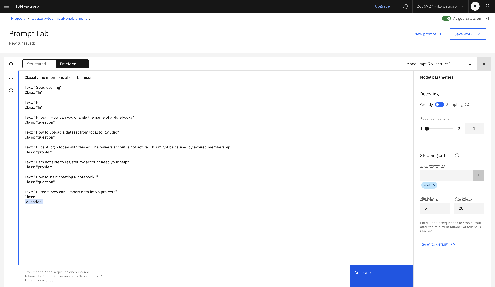
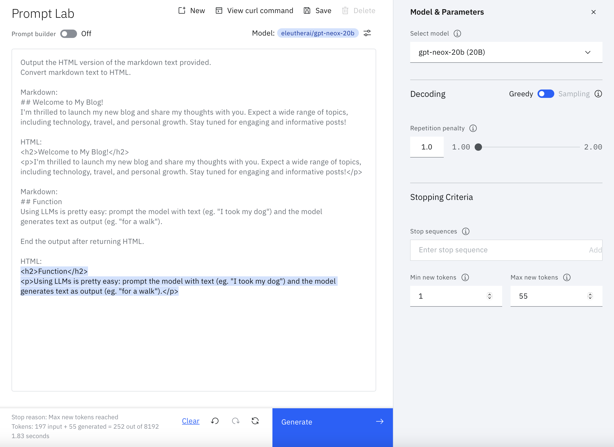
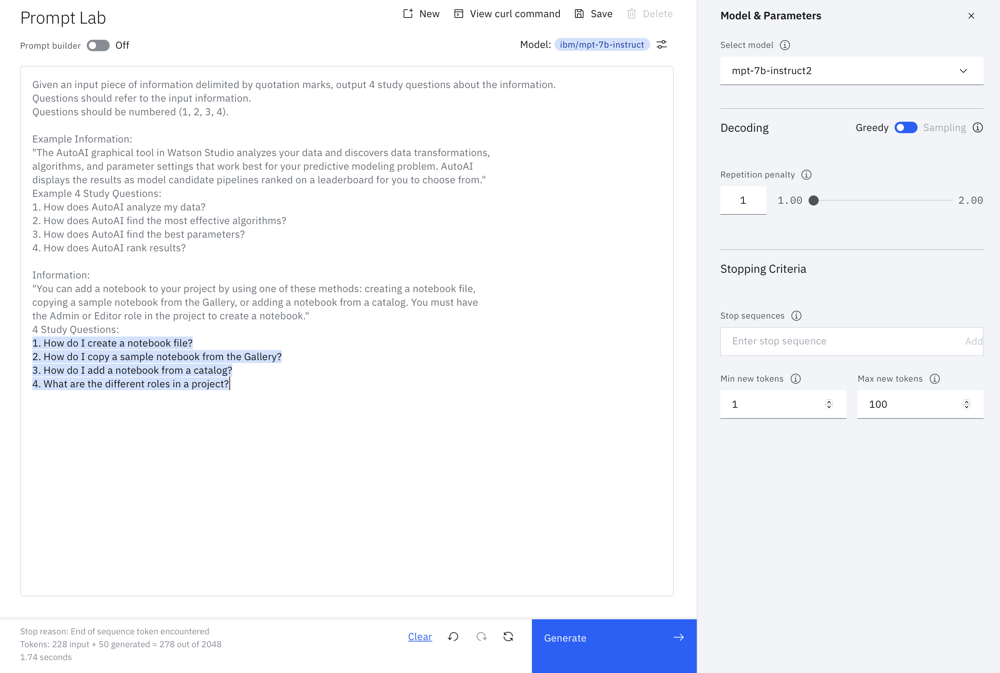
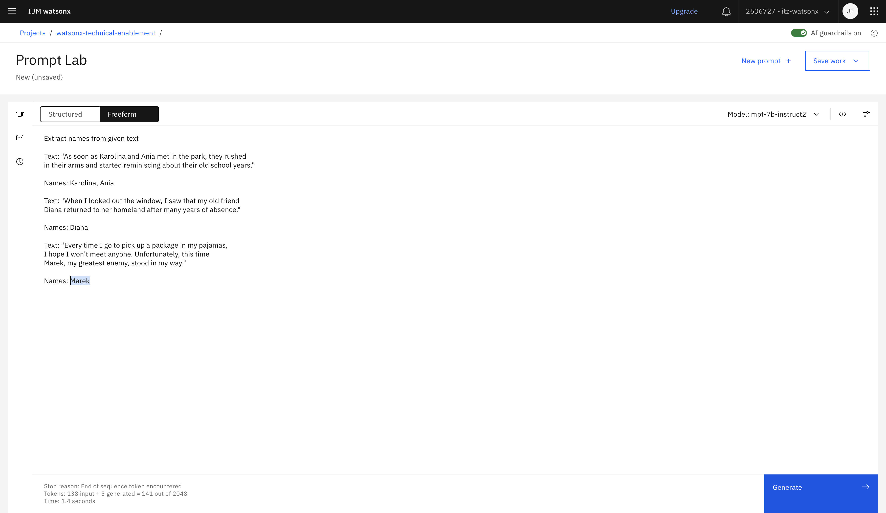
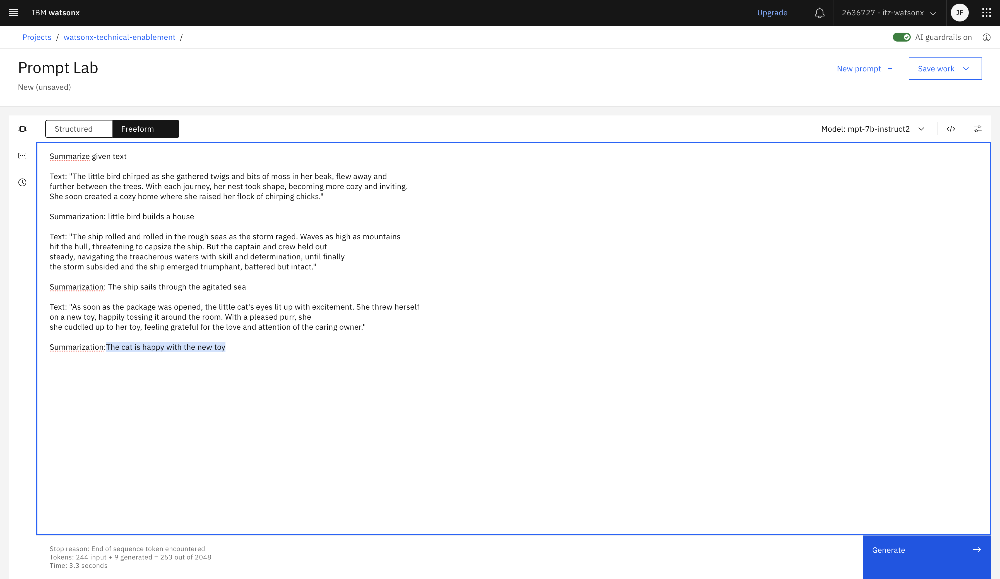

# Prompt engineering ćwiczenia z odpowiedziami 

<table>
<tr>
<td><a href="#1-classify">1. Classification</a></td>
<td>Classify the intentions of chatbot users</td>
</tr>
<tr>
<td><a href="#2-rewrite">2. Rewrite</a></td>
<td>Convert Markdown to HTML</td>
</tr>
<tr>
<td><a href="#3-study-questions">3. Anticipating questions</a></td>
<td>Anticipate potential customer questions</td>
</tr>
<tr>
<td><a href="#4-text-extraction">4. Entity extraction</a></td>
<td>Extract the names from the sentence</td>
</tr>
<tr>
<td><a href="#5-summarization">5. Summarization</a></td>
<td>Summarize the given text</td>
</tr>
</table>

&nbsp;

## 1. Classification
**Goal** 
<table>
<tr>
<td>
Classify the intentions of chatbot users
</td>
</tr>
</table>

**One possible answer**

&nbsp;

## 2. Rewrite
**Goal** 
<table>
<tr>
<td>
Convert Markdown to HTML
</td>
</tr>
</table>

**One possible answer**

&nbsp;

## 3. Anticipating questions
**Goal** 
<table>
<tr>
<td>
Anticipate potential customer questions
</td>
</tr>
</table>
  
**One possible answer**

&nbsp;

## 4. Entity extraction
**Goal** 
<table>
<tr>
<td>
Extract the names from the sentence
</td>
</tr>
</table>

**One possible answer**

&nbsp;

## 5. Summarization
**Goal** 
<table>
<tr>
<td>
Summarize the given text
</td>
</tr>
</table>
  
**One possible answer**

&nbsp;

