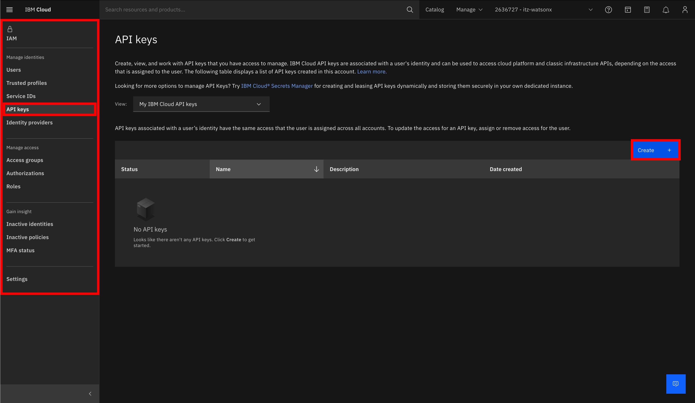

# Lab 2 - Advanced Prompt Engineering 

### Introduction

In this [Jupyter Notebook](./prompt_engineering_challenge.ipynb) You will find a solution to connect to watsonx.ai platform via Python code. In addition, You will have an opportunity to prepare a few prompts directly from code.

### Get Your api_key
As part of this lab, we will connect to the watsonx.ai environment from the code level. For this we will need our unique key - api_key - which can be generated from your IBM Cloud account. Here are some steps how to do it:

1. We log in to our IBM Cloud account, and then go to the Manage tab

  

2. After expanding the Manage tab, select the Access (IAM) option in the Security and access section

  

3. After going to Access (IAM), look for the API Keys tab on the left, and then click on "Create" to create a new API key for today's labs.

  

4. In the next step, we name our key - watsonxai in my case - and click Create

  

5. Next, copy the newly created key and place it in the second section of the code in the prompt_engineering_challenge.ipynb notebook under the variable api_key.

  

