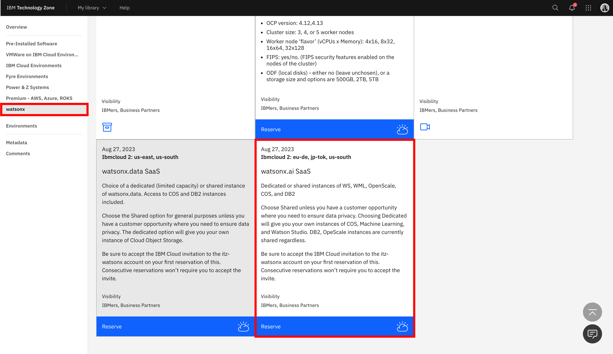
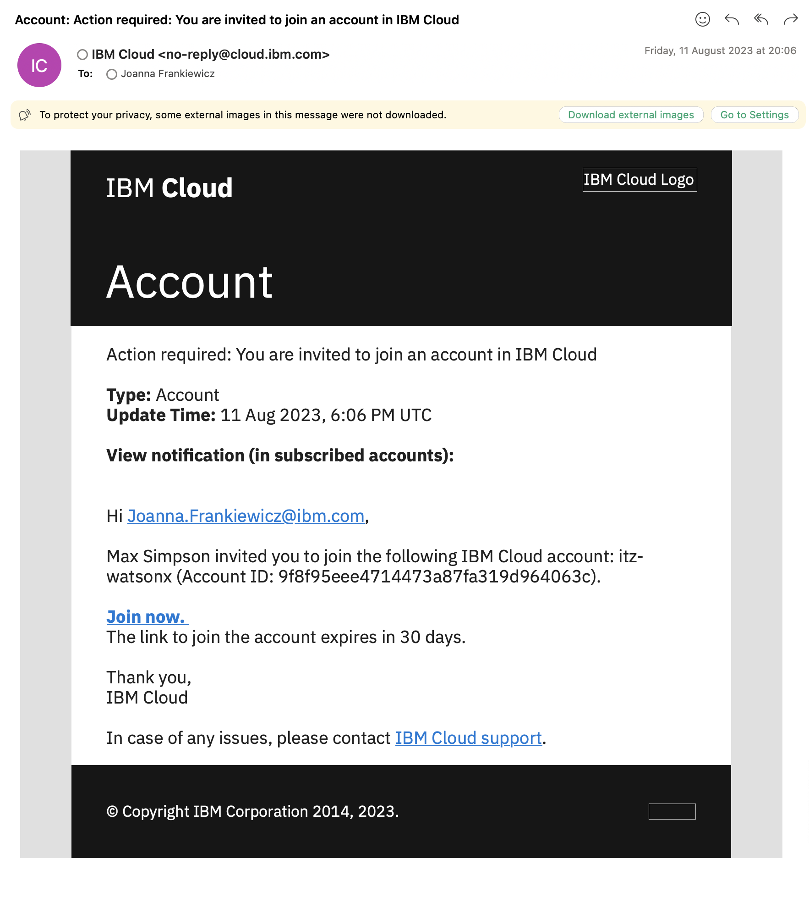
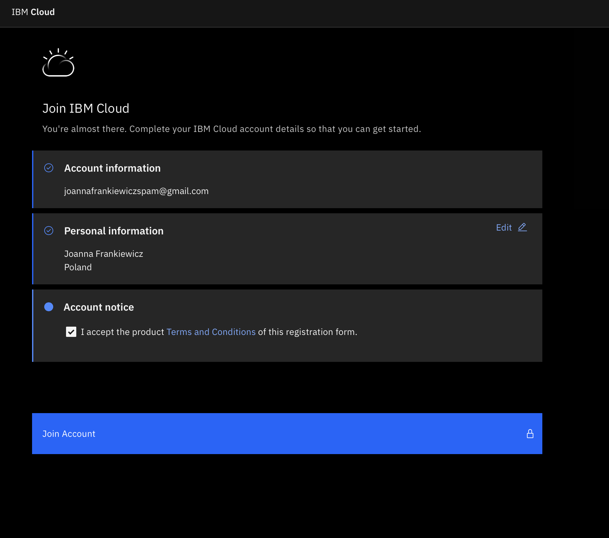
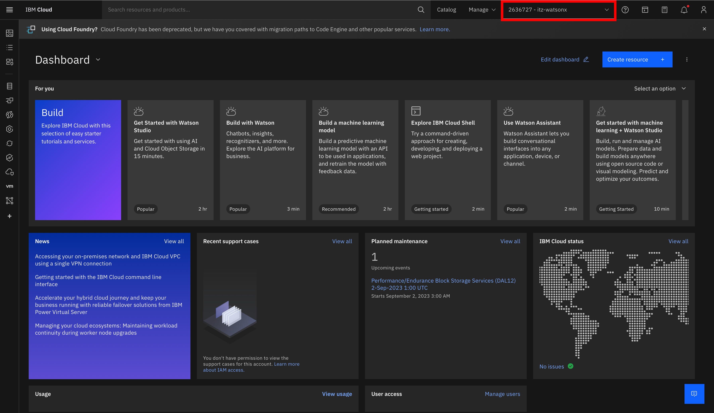
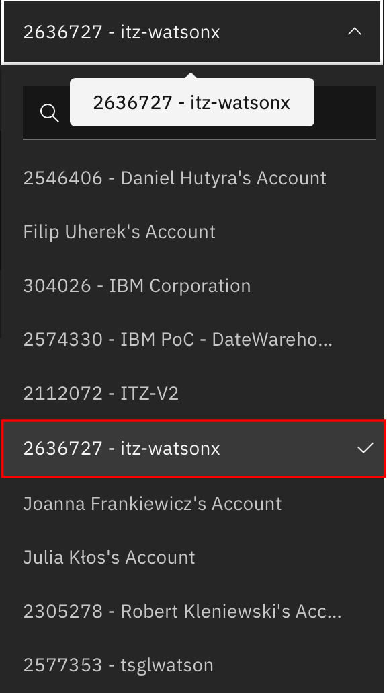

# Przygotowanie środowiska 

### IBMid
Pierwszym, podstawowym wymogiem, do przystąpienia do niniejszego laboratorium, jest posiadanie swojego IBMid, umożliwiającego zalogowanie się do IBM Cloud. Jeśli nie posiadasz swojego IBMid, możesz uzyskać je, wypełniając formularz dostępny pod poniższym linkiem:

```
https://www.ibm.com/account/reg/us-en/signup?formid=urx-19776&target=https%3A%2F%2Flogin.ibm.com%2Foidc%2Fendpoint%2Fdefault%2Fauthorize%3FqsId%3Db9977aed-1e6b-4321-9b43-ee4365544452%26client_id%3DODllMDk4YzItMjgxOC00&_gl=1*1nosucy*_ga*MTc5MjI1NTMxNS4xNjg5MDcxNjU0*_ga_FYECCCS21D*MTY5Mjc5NTYxOS43NS4xLjE2OTI3OTYxNTQuMC4wLjA
```

### Środowisko watsonx.ai
W celu uzyskania dostępu do środowiska, w pierwszej kolejności należy uzyskać dostęp do środowiska watsonx.ai SaaS.
Dostęp można uzyskać poprzez rezerwację od prowadząego szkolenie lub rezerwując środowisko watsonx.ai SaaS bezpośrednio z [Techzone](https://techzone.ibm.com/collection/tech-zone-certified-base-images/journey-watsonx)

<p align="center">
  
</p>

<p align="center">
  
</p>

### Zaproszenie do dołączenia do IBM Cloud
Po niedługim czasie po uzyskaniu dostępu do środowiska na TechZone, na Twojej skrzynce powinien pojawić się mail od IBM Cloud o temacie: "Account: Action required: You are invited to join an account in IBM Cloud". 

<p align="center">
  
</p>


W celu uzyskania dostępu do konta, należy kliknąć w "Join now", które powinno przenieść nas do strony logowania, a następnie do formularza, w którym należy zaznaczyć checkbox z napisem "I accept the product Terms and Conditions of this registration form".

<p align="center">
  
</p>

Rezultatem tego działania powinien być następujący widok z poziomu (IBM Cloud)[https://cloud.ibm.com]

<p align="center">
  
</p>

Jeśli Twój widok z IBM Cloud wskazuje profil innego użytkownika, rozwiń listę dostępnych kont i poszukaj konta "itz-watsonx"

<p align="center">
  
</p>

Jeśli nie możesz znaleźć nazwy itz-watsonx na liście, przejdź proces dołączenia do konta itz-watsonx w IBM Cloud z wykorzystaniem przeglądarki w trybie prywatnym.

### Dostęp do konta itz-watsonx z poziomu watsonx.ai

Sprawdź czy posiadasz dostęp do środowiska po podanym adresem:

```
https://dataplatform.cloud.ibm.com/wx/home?context=wx
```
Przed rozpoczęciem laboratorium, upewnij się, że konto na które jesteś zalogowany nosi nazwę:

```
itz-watsonx
```

### Środowisko python
Środowisko Python będzie potrzebne do przeprowadzenia drugiej części warsztatów, gdzie z poziomu Jupyter notebooka będziesz mógł komunikowac się z duzymi modelami językowymi w serwisie WatsonX. 

Aby przygotować swoje środowisko Python, musisz mieć zainstalowane na swoim komputerze narzędzie `podman`, gdyż będziemy używali kontenerów.

Jeżeli nie masz go zainstalowanego, to pobierz pakiet instalacyjny ze strony https://podman.io w sekcji "Downloads". Uruchom program instalacyjny i postępuj zgodnie z instrukcjami dla Twojego systemu operacyjnego opisanymi na stronie https://podman.io/docs/installation 

Po poprawnej instalacji narzędzia `podman`, uruchom okno terminala i zainicjuj maszynę wirtualną `podman` wykonując sekwencję następujących komend:
```
podman machine init
podman machine start
```

Podman korzysta z QEMU, więc po wykonaniu komend wskazanych powyżej sprawdź, czy maszyna wirtualna działa poprawnie wykonując w tym samy oknie terminala komendę:
```
podman machine list 
```

Jeżeli `podman` jest gotowy do pracy, to powinieneś uzyskać na ekranie następujące informacje:
```
NAME                     VM TYPE     CREATED        LAST UP            CPUS        MEMORY      DISK SIZE
podman-machine-default*  qemu        14 months ago  Currently running  1           2GiB        100GiB
```

Świetnie, środowisko do uruchamiania kontenerów mamy przygotowane. Zbudujmy zatem kontener z naszym Jupyter Serwerem. 

utwórz w dowolnym katalogu plik `Dockerfile` posiadający następującą treść
```
FROM jupyter/base-notebook:latest

RUN pip install --upgrade pip
RUN pip install ibm_watson_machine_learning

EXPOSE 8888

ENTRYPOINT jupyter notebook --ip='*' --NotebookApp.token='' --NotebookApp.password=''
```

plik `Dockerfile` posłuży nam do zbudowania naszego obrazu Dockera z zainstalowanymi bibliotekami pythona. 

W celu zbudowania takiego obrazu o nazwie `jupyter-img` wykonaj komendę w oknie terminala będąc w katalogu w jakim znajduje się utworzony przez Ciebie plik `Dockerfile`
```
podman build -t jupyter .
```

uruchom kontener z utworzonego wcześniej obrazu Dockera komendą
```
podman run -d --name jupyter -p 8888:8888 jupyter
```

sprawdź, czy kontener o nazwie jupyter działa komendą:
```
podman ps -a 
```

Jeżeli wynik działania komendy w kolumnie STATUS pokazuje wartość UP, oznacza to, że kontener został uruchomiony poprawnie.

Teraz w dowolnej przeglądarce WEB, uruchom stronę o URL: http://localhost:8888
W prawym górnym rogu przeglądarki znajdziesz przycisk `Upload`, wciśnij go aby załadować przygotowany jupyter notebook `prompt_engineering_challenge.ipynb` - znajdziesz go w repozytorium GIT, podany przez prowadzącego. 

URL: https://raw.github.ibm.com/Robert-Kleniewski/techxchange-watsonx/main/LABS/pl/basic/part2-watsonx-python/prompt_engineering_challenge.ipynb?token=AADMNMNAZYMAOIVIPQAA6O3E73OMY >> Zapisz jako >> pamiętaj plik musi kończyć się .ipynb

po załadowaniu jupyter notebooka jesteś gotowy do pracy.
