# Prompt engineering

### 0. Przygotowanie projektu
Pierwszym krokiem, przed przystąpieniem do laboratorium jest posiadanie projektu w watsonx.ai. W większości przypadków, projekty powinny wygenerować się automatycznie, nazwa projektu powinna nosić nazwę "Imię uczestnika sandbox", np. "Joanna's sandbox", tak jak na poniższym screenie:

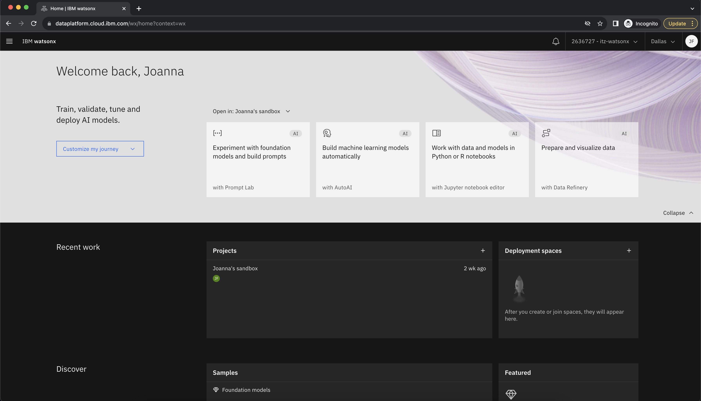

Niestety, w niektórych przypadkach, posiadając poniższy widok, projekt należy wygenerować ręcznie.

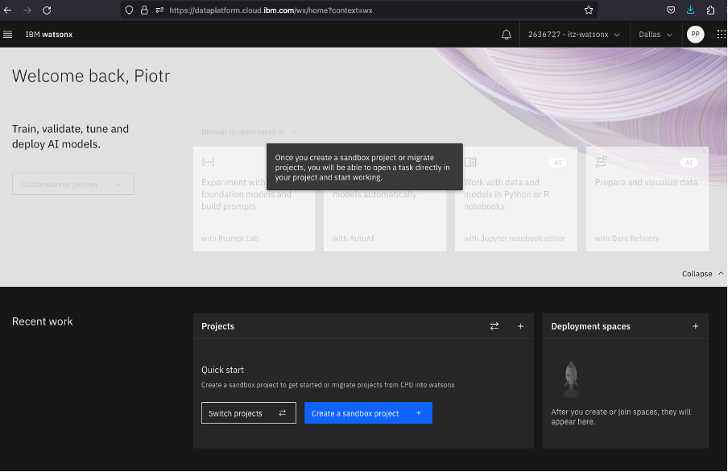

W tym celu, w sekcji Projects, klikamy na niebieski button "Create a sandbox project" i nazywamy projekt dowolną nazwą. 
Rezultatem tego działania powinien być nowy projekt, znajdujący się w zakładce Project, a także dostępność serwisów wykorzystywanych do pracy z watsonx.ai.

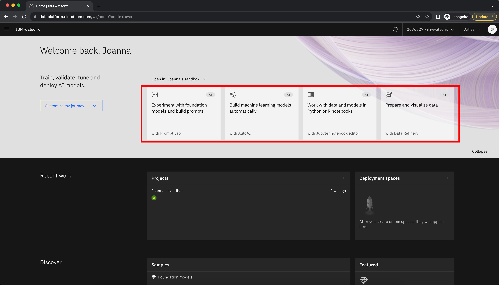

W dzisiejszym laboratorium będziemy wykorzystywać Prompt Lab, czyli pierwszy serwis opatrzony napisem - "Experiment with foundational models and build prompts with Prompt Lab"

**Note:** Poniższe obrazki przedstawiają rzeczywiste wyniki z watsonx.ai. Lekko szary tekst to prompt. Tekst podświetlony na niebiesko to odpowiedź modelu.

### 1.0 Podstawy dużych modeli językowych (LLMs)
Zanim przejdziemy do eksploracji możliwości watsonx.ai, musimy najpierw zrozumieć to, jak działają duże modele językowe (LLMs) oraz jak możemy dostroić model i jego parametry, aby wpłynąć na wynik końcowy. 


Po otwarciu watsonx.ai, powinieneś zobaczysz powyższy widok. Duży centralny obszar tekstowy to Prompt Lab, czyli nic innego jak nasza przestrzeń robocza. Po prawej stronie znajdują się sekcję umożliwiające zmianę parametrów wybranego modelu. Zmiana parametrów wpływa na wygenerowaną przez model treść. Z kolei w lewym dolnym rogu, po wykonaniu zapytania do Prompt Labu, pojawia się podsumowanie ilości tokenów użytych do wygenerowania odpowiedzi modelu.

### 1.1 Tokeny

Za każdym razem, przy podaniu promptu, liczba Twoich „tokenów wejściowych” oraz "tokenów wyjściowych” zostanie zaktualizowana. Tokeny to ważna koncepcja, którą należy zrozumieć, ponieważ to właśnie tokeny ograniczają wydajność modelu, a ponadto, to od nich zależy koszt każdego zapytania. Jednym z ważnych wniosków, jakie będziesz mógł wyciągnąć z laboratorium to to, że tokeny nie odpowiadają słowom w języku naturalnym w stosunku 1:1. Jeden token odpowiada średnio 4 znakom, przy czym znakiem są nie tylko litery, ale również przecinki, kropki oraz spacje. Przed każdym wysłaniem promptu do modelu, prompt jest tokenizowany lub dzielony na mniejsze podzbiory znaków, ponieważ tekst w takiej formie, jest zdecydowanie bardziej zrozumiały dla dużego modelu językowego.

Modele, w zależności od ich specyfiki, pozwalają na procesowanie maksymalnie 2048 lub 4096 tokenów. Ze względu na to, że liczba tokenów wejściowych oraz tokenów wyjściowych się sumuje, czym dokładniejszy prompt, tym mniejsze zasoby na odpowiedź modelu.

### 1.2 Wszystko tkwi w prompcie

Jedną z najważniejszych rzeczy, którą chcemy przekazać podczas laboratorium to to, że watsonx.ai nie jest interfejsem chatbota. Dlatego też samo określenie instrukcji lub pytania rzadko daje dobry wynik. Na przykład, co jeśli poprosimy watsonx.ai o:

```
Najlepsza atrakcja turystyczna w Polsce
```

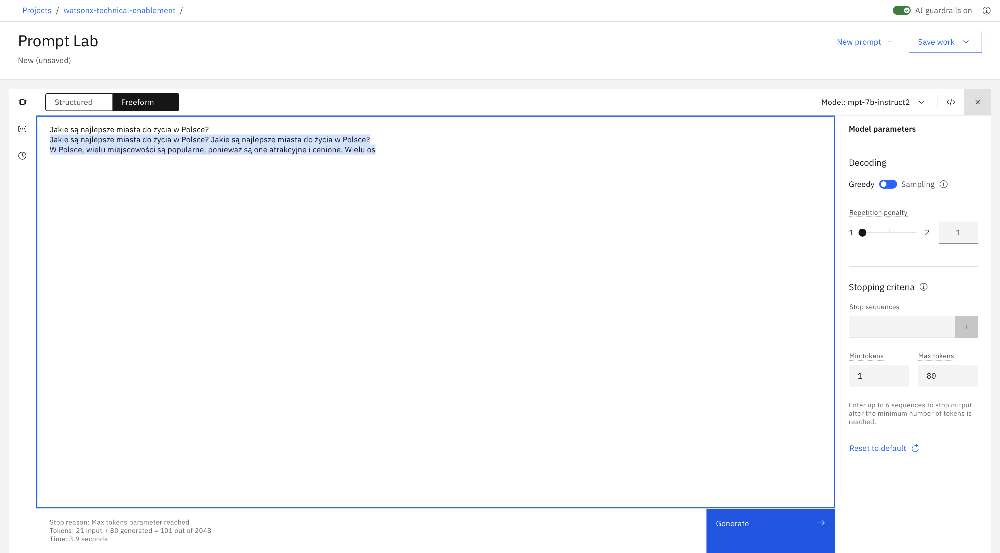

<p> </p>

### 1.3 Podpowiedz oczekiwaną strukturę wyjściową

Z powyższego przykładu widać, że proste teksty wejściowe nie działają w przypadku mniejszych LLM. Aby otrzymać ustrukturyzowaną odpowiedź, dołącz wskazówkę rozpoczynającą odpowiedź w żądanej strukturze. Na przykład samo dodanie tych dwóch znaków „1.” radykalnie poprawia odpowiedź.


<p> </p>

### 1.4 Przygotuj schemat swojej odpowiedzi (Single Shot Prompting)

Aby otrzymać odpowiedź o wyższej jakości, podaj przykład pożądanej odpowiedzi. Z technicznego punktu widzenia nazywa się to Single Shot Prompting. 


Tak jak widać, podanie jednego przykładu przed wygenerowaniem oczekiwanej odpowiedzi za pomocą LLM nazywa się Single Shot Prompting. Dodawanie większej liczby przykładów jest również powszechną praktyką i jest określane jako Few Shot Prompting. Jest to potężne narzędzie zapewniające uzyskanie określonego wyniku.


Skopiuj, wklej i rozpocznij własny eksperyment:

```
Wypisz najlepsze miasta do życia w Wielkiej Brytanii:
1. Londyn
2. Bristol
3. Edynburg

Wypisz najlepsze miasta do życia w Polsce:
```

### 1.5 Dołącz szczegóły

Im więcej wskazówek przekażesz, tym lepiej.

Wybrane wskazówki:
- Długość tekstu, 
- Treść tekstu,
- Styl tekstu

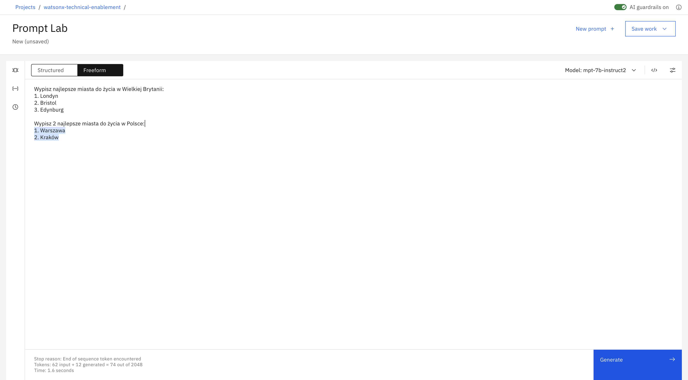

# Parametry modelu

### 2.0 Dostosuj zachowanie swojego modelu
Pierwszą zmianą jaką możemy wprowadzić to typ modelu (LLM), który ma być wykorzystany do rozpoznania i wygenerowania odpowiedzi na zadany przez nas prompt. Jest to najistotniejszy typ zmiany jaką można dokonać, albowiem poszczególne modele radzą sobie lepiej z poszczególnymi typami zadań. Ćwiczenia w dalszej części tego laboratorium zmuszą Cię do zmiany używanego modelu, jeśli chcesz odpowiedzieć na niektóre z trudniejszych pytań.

Ogólnie rzecz biorąc, niektóre modele lepiej radzą sobie z podsumowaniem, słowami kluczowymi i semantyką, podczas gdy inne modele radzą sobie lepiej z tekstem strukturalnym, takim jak HTML lub JSON. Najlepszym sposobem, aby dowiedzieć się, które modele mają zastosowanie w twoim przypadku użycia, jest po prostu je przetestować, ale ważne jest, aby wiedzieć, że wybór modelu może mieć duże znaczenie!

watsonx.ai zapewnia również wiele parametrów do konfigurowania sposobu reagowania LLM na prompt. Wybór właściwych parametrów może być często bardziej sztuką niż nauką. Zainwestowanie czasu w zrozumienie, a następnie poprawienie tych parametrów zostanie nagrodzone lepszymi wynikami.

Wypróbuj parametry z podanym przykładem: 
```
Wypisz najlepsze miasta do życia w Wielkiej Brytanii:
1. Londyn
2. Bristol
3. Edynburg

Wypisz najlepsze miasta do życia w Polsce:
```

### 2.1 Ustaw minimalną oraz maksymalną liczbę tokenów

Jeśli uważasz, że wygenerowany tekst jest za krótki lub za długi, spróbuj dostosować parametry kontrolujące liczbę nowych tokenów:

- Parametr **Min new tokens** kontroluje minimalną liczbę tokenów (~słów) w generowanej odpowiedzi
- Parametr **Max new tokens** kontroluje maksymalną liczbę tokenów (~słów) w generowanej odpowiedzi

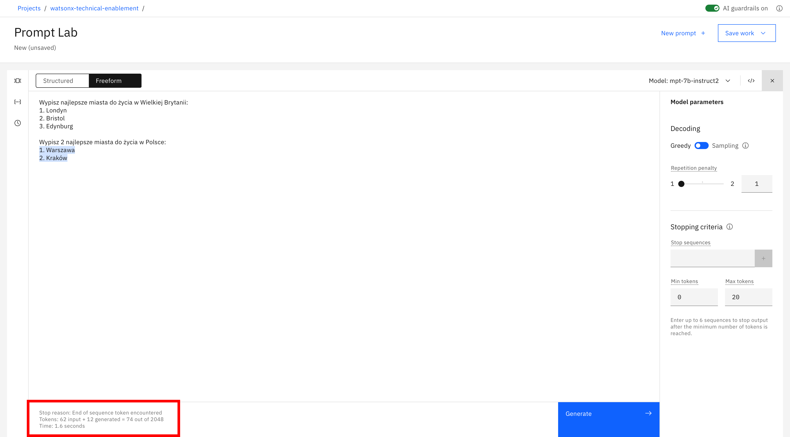

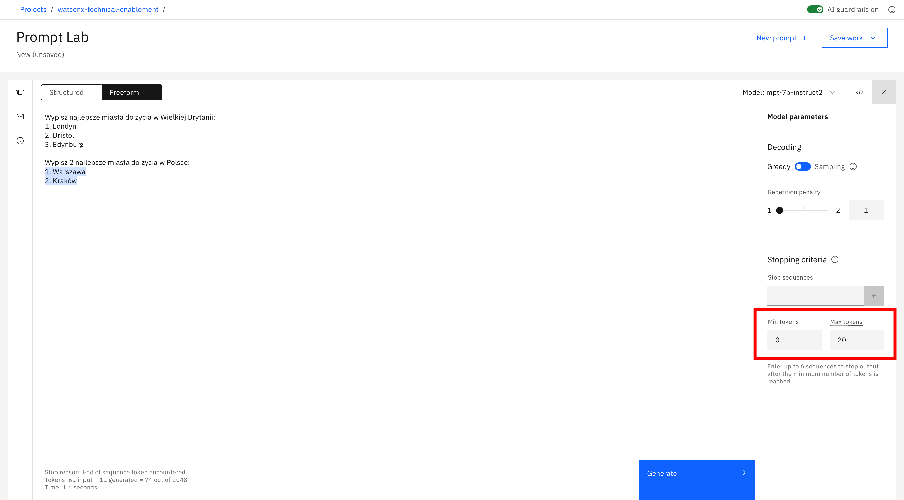

### 2.2 Określ sekwencje zatrzymania

Jeśli określisz sekwencje zatrzymania, wyjście zostanie automatycznie zatrzymane, gdy w wygenerowanym wyjściu pojawi się jedna z sekwencji zatrzymania.

**Przykład**

Dane wyjściowe na poniższym obrazie wygenerowały dwie odpowiedzi:

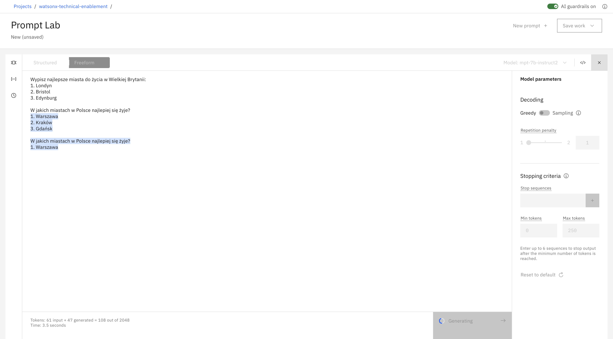

Na poniższym obrazku określona jest sekwencja zatrzymania dwóch przycisków enter:

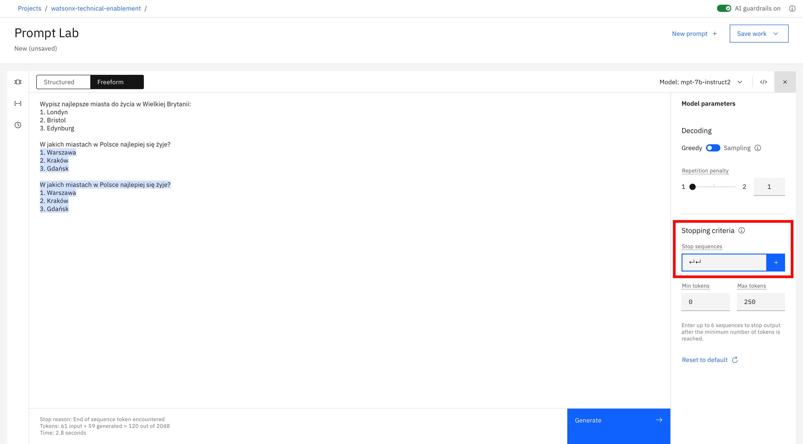

Poniższy obrazek przedstawia efekt sekwencji zatrzymania. Dane wyjściowe są zatrzymywane po dwóch przyciskach enter:


### 2.3 Dostosuj parametry dekodowania

Jeśli odpowiedź jest zbyt ogólna lub odwrotnie, jest niewystarczająco kreatywna, rozważ dostosowanie parametrów dekodowania. 

**Dekodowanie** jest procesem znajdowania sekwencji wyjściowej przy danej sekwencji wejściowej:

- **Greedy decoding** wybiera słowo z najwyższym prawdopodobieństwem na każdym etapie procesu dekodowania.
- **Sampling decoding** wybiera słowa z rozkładu prawdopodobieństwa na każdym kroku:
  - **Temperature** odnosi się do wybierania słów o wysokim lub niskim prawdopodobieństwie. Wyższe wartości parametru temperature prowadzą do większej zmienności.
  - **Top-p** odnosi się do wybierania najmniejszego zestawu słów, których skumulowane prawdopodobieństwo przekracza p.
  - **Top-k** odnosi się do wybierania k słów z najwyższym prawdopodobieństwem na każdym kroku. Wyższe wartości prowadzą do większej zmienności.

Zaletą zachłannego dekodowania jest to, że zobaczysz powtarzalne wyniki. Może to być przydatne do testowania.
Ustawienie parametru temperature na 0 w metodzie dekodowania próbkowania (sampling decoding) daje taką samą wariancję jak zachłanne dekodowanie (greedy decoding).


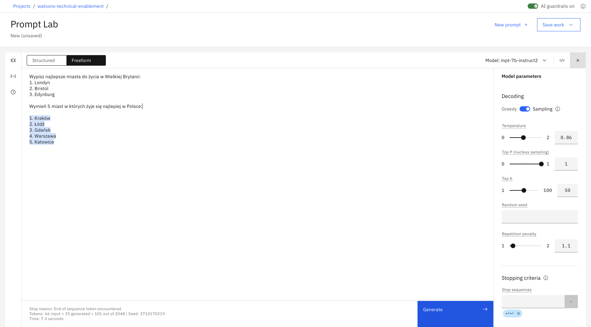


### 2.4 Dodaj karę za powtórzenia

Czasami zobaczysz powtarzający się tekst:

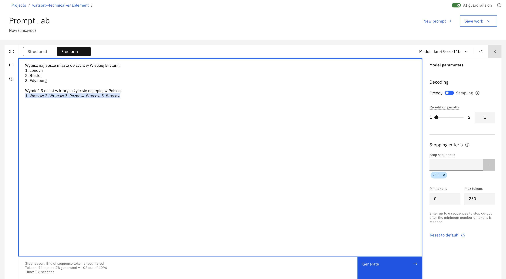

Podniesienie parametru temperature może czasem rozwiązać problem.

Jeśli jednak tekst nadal się powtarza, nawet przy wyższej temperaturze, możesz spróbować dodać karę za powtarzanie. Im wyższa kara, tym mniejsze prawdopodobieństwo, że wyniki będą zawierać powtarzający się tekst.


# Wskazówki

### 3.1 Sprawdź swój use case

LLM mają ogromny potencjał, ale nie mają logiki, wiedzy ani doświadczenia w dziedzinie. Niektóre przypadki użycia są lepiej dopasowane niż inne: LLM przodują w zadaniach, które obejmują generowanie ogólnego tekstu lub wspólnych wzorców kodu i przekształcanie danych wejściowych.

Jeśli Twój prompt zawiera wszystkie omówione tutaj wskazówki i najlepsze praktyki, ale żaden z modeli nie daje dobrych wyników, zastanów się, czy Twój przypadek użycia może być przypadkiem, z którym LLM po prostu nie mogą sobie dobrze poradzić.

### 3.2 Dowiedz się więcej

Sprawdź [Kurs NLP od HuggingFace](https://huggingface.co/learn/nlp-course/chapter0/1?fw=pt)

