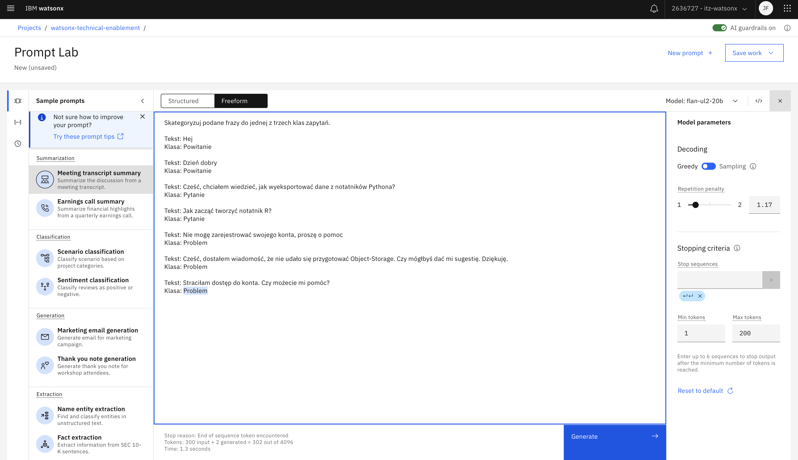
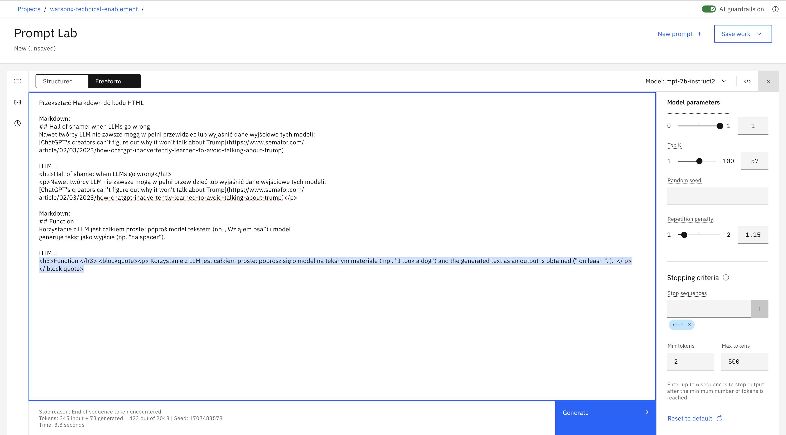
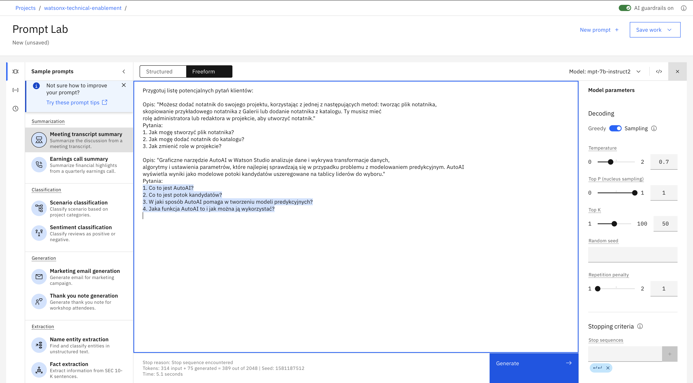
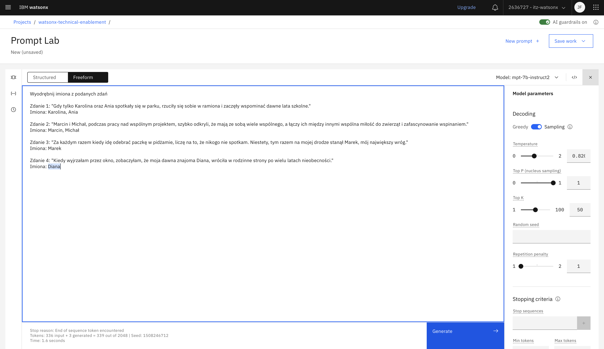
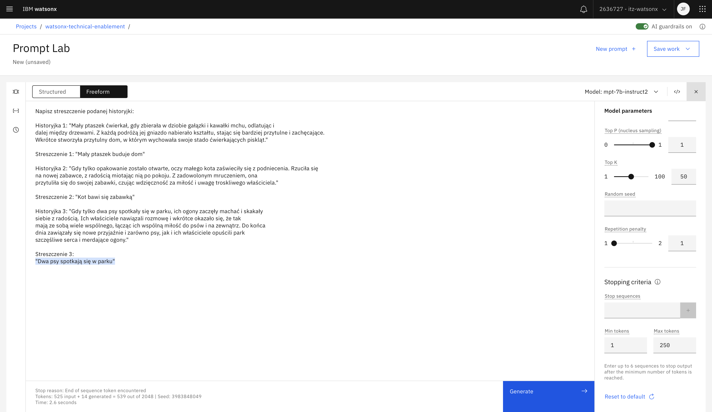

# Prompt engineering ćwiczenia z odpowiedziami 

<table>
<tr>
<td><a href="#1-classify">1. Klasyfikacja</a></td>
<td>Wykrywaj intencje użytkowników chatbota</td>
</tr>
<tr>
<td><a href="#2-rewrite">2. Napisz od nowa</a></td>
<td>Przekształć Markdown do HTML</td>
</tr>
<tr>
<td><a href="#3-study-questions">3. Przewidywanie pytań</a></td>
<td>Przewiduj potencjalne pytania klientów</td>
</tr>
<tr>
<td><a href="#4-text-extraction">4. Ekstrakcja tekstu</a></td>
<td>Wyodrębnij imiona ze zdania</td>
</tr>
<tr>
<td><a href="#5-summarization">5. Sumaryzacja</a></td>
<td>Streść podany tekst</td>
</tr>
</table>

&nbsp;

## 1. Klasyfikacja
**Cel** 
<table>
<tr>
<td>
Wykrywaj intencje użytkowników chatbota
</td>
</tr>
</table>

**Jedna z możliwych odpowiedzi**

&nbsp;

## 2. Napisz od nowa
**Cel** 
<table>
<tr>
<td>
Przekształć Markdown do HTML
</td>
</tr>
</table>

**Jedna z możliwych odpowiedzi**

&nbsp;

## 3. Przewidywanie pytań
**Cel** 
<table>
<tr>
<td>
Przewiduj potencjalne pytania klientów
</td>
</tr>
</table>
  
**Jedna z możliwych odpowiedzi**

&nbsp;

## 4. Ekstrakcja tekstu
**Cel** 
<table>
<tr>
<td>
Wyodrębnij imiona ze zdania
</td>
</tr>
</table>

**Jedna z możliwych odpowiedzi**

&nbsp;

## 5. Sumaryzacja
**Cel** 
<table>
<tr>
<td>
Streść podany tekst
</td>
</tr>
</table>
  
**Jedna z możliwych odpowiedzi**

&nbsp;

